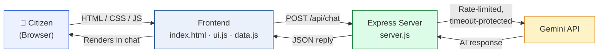

<div align="center">

# ⚖️ NyayaSetu
### *"Nyaya" (Justice) + "Setu" (Bridge) — Bridging Citizens to Their Rights*

**An AI-powered civic and legal empowerment platform that turns India's bureaucratic complexity into a clear, guided path.**

[](https://nyayasetu-xtpc.onrender.com)
[](https://github.com/Rajat-29104/NyayaSetu)
[](https://nodejs.org)
[](https://expressjs.com)
[](https://ai.google.dev)

**[🚀 Try it Live](https://nyayasetu-xtpc.onrender.com) &nbsp;·&nbsp; [📂 View Source](https://github.com/Rajat-29104/NyayaSetu) &nbsp;·&nbsp; [🐛 Report a Bug](https://github.com/Rajat-29104/NyayaSetu/issues) &nbsp;·&nbsp; [💡 Request a Feature](https://github.com/Rajat-29104/NyayaSetu/issues)**

</div>

---

## 📖 Table of Contents

- [About the Project](#-about-the-project)
- [The Problem](#-the-problem)
- [The Solution](#-the-solution)
- [Live Demo](#-live-demo)
- [Core Features](#-core-features)
- [Tech Stack](#-tech-stack)
- [System Architecture](#-system-architecture)
- [Project Structure](#-project-structure)
- [Getting Started](#-getting-started)
- [Environment Variables](#-environment-variables)
- [API Reference](#-api-reference)
- [Deployment](#-deployment-render)
- [Security Notes](#-security-notes)
- [Roadmap](#-roadmap)
- [Contributing](#-contributing)
- [Author](#-author)
- [License](#-license)

---

## 🧭 About the Project

**NyayaSetu** is a civic-tech web application built to close the gap between the rights and welfare schemes the Indian government provides on paper, and the citizens who never find out these rights exist or don't know how to claim them.

It combines a **structured database of government schemes, constitutional rights, and grievance portals** with a **Gemini-powered conversational AI assistant**, so that any citizen — regardless of legal literacy — can:

- find out which government schemes they actually qualify for,
- understand their fundamental and legal rights in plain language,
- generate a legally correct **RTI (Right to Information)** application in seconds,
- know exactly which portal to file a complaint on, and
- ask a free-text question and get grounded, non-alarmist civic guidance.

This project was built as a solo full-stack effort — frontend, backend, AI integration, and civic data curation — with a strong focus on **clarity, trust, and accessibility** over flashy design, because the people this is meant to help are often the least comfortable navigating complex software.

---

## ❗ The Problem

India runs hundreds of welfare schemes and has strong constitutional protections — but most citizens who are eligible never claim them, because:

- Scheme eligibility criteria are scattered across dozens of government portals, in dense legal language.
- Most people don't know an RTI application is a *right*, let alone how to format one correctly.
- When something goes wrong (a scholarship stuck, a police station refusing an FIR, a workplace harassment complaint), people don't know **which of the 10+ overlapping grievance portals** to use.
- Legal aid exists (NALSA offers it *free*) but almost nobody knows they're eligible.

The result: entitlements go unclaimed, and grievances go unfiled, not because the systems don't exist — but because they're invisible to the people who need them.

## 💡 The Solution

NyayaSetu acts as a **single, guided front door** to all of this — a civic assistant that:

1. Asks a few simple questions and matches the user against a structured scheme database (instead of making them read scheme PDFs).
2. Lets them click through constitutional rights by category instead of searching bare acts.
3. Auto-drafts a legally formatted RTI letter from a plain-English description of the problem.
4. Routes complaints to the correct authority through a guided, step-by-step wizard.
5. Answers open-ended questions through a Gemini-backed AI chat that is explicitly prompted to give **practical, non-alarmist, non-legal-advice** guidance and prefer official government sources.

---

## 🌐 Live Demo

The project is deployed and publicly accessible on Render:

### 👉 **[nyayasetu-xtpc.onrender.com](https://nyayasetu-xtpc.onrender.com)**

> ⏳ **Note:** This is hosted on Render's free tier, which spins down after inactivity. The first request after idle time may take **20–30 seconds** to wake the server — this is expected, not a bug.

---

## ✨ Core Features

| Module | What it does |
|---|---|
| 🎯 **Scheme Eligibility Engine** | Answer a short form (category, gender, income, education, disability) and get instantly matched against a curated database of government scholarships and welfare schemes, with direct links to apply. |
| ⚖️ **Rights Navigator** | Browse Fundamental Rights, Minority Rights, SC/ST Protections, Women's Rights, Disability Rights, and RTI rights — explained in plain language with the relevant Articles/Acts cited. |
| 📁 **RTI Drafting Agent** | Describe your issue in plain English and get a properly formatted, submission-ready RTI application under Section 6(1) of the RTI Act, 2005 — including BPL fee-exemption handling. Copy or print/save as PDF in one click. |
| 📋 **Complaint Filing Wizard** | A 5-step guided flow that takes any civic issue (discrimination, harassment, corruption, police misconduct, scheme denial) and tells the user exactly which official portal to file with, and what documents they'll need. |
| 🔍 **NSP Scholarship Status Guide** | Explains the 5-stage NSP scholarship verification pipeline so students can self-diagnose exactly where their stuck application is sitting. |
| 🏛️ **Grievance Portal Directory** | A single directory of every major central grievance body (CPGRAMS, NHRC, NCW, NCSC, NALSA, SHe-Box, and more) with what each one is actually for. |
| 📞 **Helpline Directory** | One-tap-to-call emergency and specialized helplines (Women, Child, Senior Citizen, Cyber Crime, Legal Aid, Disability). |
| 🤖 **Conversational AI Assistant** | A Gemini-powered chat, proxied securely through the backend, that gives grounded civic/legal guidance — with a local offline knowledge-base fallback if the AI service is ever unreachable. |
| 🌗 **Multi-language toggle** | English / Hinglish / Hindi label switching for wider accessibility. |
| ♿ **Accessibility-first UI** | Full keyboard navigation, screen-reader labels, focus-visible states, and `prefers-reduced-motion` support baked into the design system. |

---

## 🛠️ Tech Stack

**No frameworks, no build step, no bloat — by design.** This is a deliberate architectural choice: a civic tool for real users on real (often low-end) devices should load instantly, work everywhere, and be auditable by anyone who opens the source.

| Layer | Technology |
|---|---|
| Frontend | HTML5, CSS3 (custom design system, CSS variables, no framework), Vanilla JavaScript (ES6+) |
| Icons | [Lucide](https://lucide.dev) icon system |
| Backend | Node.js + Express 5 |
| AI Engine | Google **Gemini API**, called only from the server — never exposed to the browser |
| Config | `dotenv` for environment-based secrets |
| Hosting | [Render](https://render.com) (Node Web Service) |

---

## 🏗️ System Architecture



**Why this matters:** the `GEMINI_API_KEY` lives only on the server (`server.js`), read from an environment variable. The frontend never sees it — every AI request is proxied through `/api/chat`, which also enforces rate limiting, a request timeout, and input length validation before it ever reaches Google's API.

---

## 📁 Project Structure

```
NyayaSetu/
├── index.html          # App shell — sidebar nav + all page panels
├── style.css           # Full design system: tokens, layout, animations, a11y
├── data.js             # Scheme DB, rights data, grievance portals, helplines, AI fallback KB
├── ui.js               # All client logic — eligibility engine, RTI generator, AI chat, wizard
├── server.js           # Express server + secure Gemini proxy (rate limit, timeout, headers)
├── package.json        # Dependencies & scripts
├── .env.example        # Environment variable template
├── .gitignore
└── README.md
```

---

## 🚀 Getting Started

### Prerequisites
- [Node.js](https://nodejs.org) v18 or higher
- A free Gemini API key from [Google AI Studio](https://aistudio.google.com/app/apikey)

### Installation

```bash
# 1. Clone the repository
git clone https://github.com/Rajat-29104/NyayaSetu.git
cd NyayaSetu

# 2. Install dependencies
npm install

# 3. Set up environment variables
cp .env.example .env
# then open .env and paste your GEMINI_API_KEY

# 4. Run the server
npm start

# 5. Open in browser
# http://localhost:3000
```

For live-reload during development:
```bash
npm run dev
```

---

## 🔐 Environment Variables

Create a `.env` file in the project root (never commit this file):

| Variable | Required | Description |
|---|---|---|
| `GEMINI_API_KEY` | ✅ Yes | Your Gemini API key. Without it, all other features work — only the AI chat returns a friendly "not configured" message. |
| `GEMINI_MODEL` | No | Gemini model name. Defaults to `gemini-3.6-flash`. Check [Google AI Studio](https://aistudio.google.com/app/apikey) for the latest available model name. |
| `PORT` | No | Port the server listens on. Defaults to `3000` (Render sets this automatically in production). |
| `NODE_ENV` | No | `development` or `production`. |

---

## 📡 API Reference

The Express server exposes two JSON endpoints:

#### `GET /api/health`
Returns server + AI configuration status.
```json
{ "ok": true, "aiConfigured": true, "model": "gemini-2.5-flash", "env": "production" }
```

#### `POST /api/chat`
Sends a user message to Gemini through the secure server-side proxy.

**Request:**
```json
{ "message": "My NSP scholarship payment is stuck, what do I do?" }
```

**Success response (200):**
```json
{ "reply": "..." }
```

**Error responses:**
| Status | Meaning |
|---|---|
| `400` | Message missing or empty |
| `413` | Message exceeds max length (2000 chars) |
| `429` | Rate limit exceeded (12 requests/min per IP) |
| `503` | `GEMINI_API_KEY` not configured on the server |
| `504` | Gemini took too long to respond (15s timeout) |

---

## ☁️ Deployment (Render)

This project is live on **[Render](https://render.com)** as a Web Service. To deploy your own copy:

1. Fork/push this repo to your own GitHub account.
2. On Render, create a **New → Web Service** and connect the repo.
3. **Build Command:** `npm install`
4. **Start Command:** `npm start`
5. Add environment variables in the Render dashboard: `GEMINI_API_KEY`, `GEMINI_MODEL`, `NODE_ENV=production`.
6. Deploy — Render auto-assigns `PORT`, which `server.js` already reads from `process.env.PORT`.
7. Visit `/api/health` on your deployed URL to confirm `"aiConfigured": true`.

Because the frontend is served by the same Express server that handles `/api/chat`, there's **no separate frontend deployment and no CORS configuration needed** — one service, one URL.

---

## 🛡️ Security Notes

- `GEMINI_API_KEY` is read only from environment variables and never sent to the browser.
- `/api/chat` is protected by an in-memory rate limiter (12 requests/min/IP) and a 15-second timeout on the upstream Gemini call.
- Basic security headers (`X-Content-Type-Options`, `X-Frame-Options`, `Referrer-Policy`, `Permissions-Policy`) are set on every response.
- Request bodies are capped at 64KB; chat messages are capped at 2000 characters.
- The AI is explicitly system-prompted to give general civic information — not legal advice — and to prefer official government sources.
- `.env` is git-ignored. If a real key is ever accidentally committed, **revoke it immediately** in Google AI Studio and issue a new one.

---

## 🗺️ Roadmap

- [ ] User accounts to save eligibility results and RTI drafts
- [ ] PDF export for RTI letters (currently print-to-PDF via browser)
- [ ] Expand scheme database with state-level (not just central) schemes
- [ ] Full Hindi-language UI (not just label toggling)
- [ ] SMS/WhatsApp fallback for users without reliable internet
- [ ] Admin panel for keeping scheme/portal data current without a code change

---

## 🤝 Contributing

Contributions, issue reports, and scheme/data corrections are welcome.

```bash
# 1. Fork the repo
# 2. Create your feature branch
git checkout -b feature/amazing-feature

# 3. Commit your changes
git commit -m "Add: amazing feature"

# 4. Push and open a Pull Request
git push origin feature/amazing-feature
```

> Civic data changes (schemes, helplines, portal URLs) should link to an official government source in the PR description — this project intentionally avoids inventing or guessing civic facts.

---

[](https://github.com/Rajat-29104)

---

<div align="center">

### If NyayaSetu helped you understand this project, consider ⭐ starring the repo!

*Built to make "knowing your rights" as easy as asking a question.*

</div>
